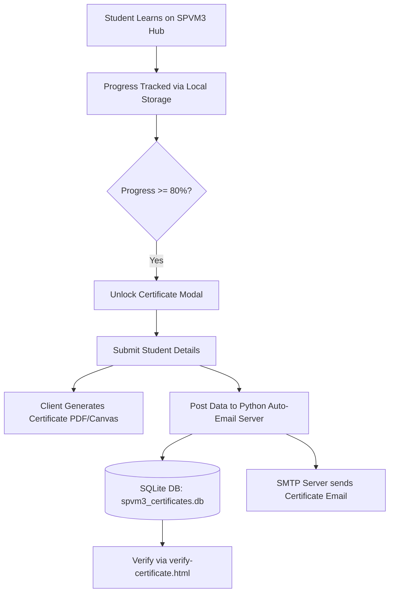

# SPVM3 Tech Solution — Computer Science Notes & Automated Certification Hub 🚀

[](http://localhost:8000/verify-certificate.html)
[](LICENSE)
[](https://github.com/sanjayGL2006/SPVM3-code-notes)

Welcome to the official repository of **SPVM3 Tech Solution**, founded by **Sanjay G L**. This project serves as a comprehensive, centralized learning hub containing **21 master computer science reference modules**, interactive progress tracking, an automated ISO-certified certificate generation engine, and a live certificate verification portal.

---

## 🌟 Key Features

- 📚 **21 Complete Subject Notes**: Detailed interactive reference guides covering fundamental programming, web development, core computer science, cloud infrastructure, and AI.
- 🎯 **Interactive Progress Tracker**: Live course progress tracking across all modules targeting 80%+ completion for certification eligibility.
- 📜 **Automated ISO Certificate Generator**: Dynamic client-side certificate rendering via canvas/PDF export (`spvm3_certificate_system.js`).
- 📧 **Automated Email Dispatch Server**: Python backend service (`spvm3_auto_email_certificate_server.py`) for automated email delivery with attachments to students upon course completion.
- 🔍 **Certificate Verification Portal**: Instant authenticity validation against unique certificate hashes (`verify-certificate.html`).
- 🎨 **Modern Dark Glassmorphism UI**: High-contrast, responsive user interface built with modern typography, smooth gradients, and micro-interactions.

---

## 📖 Curriculum & Subject Modules

| Category | Subject Notes / Reference Guides |
| :--- | :--- |
| **Programming Languages** | `C-Programming-Complete-Notes.html`<br>`cpp-notes.html`<br>`java-notes.html`<br>`python_notes.html`<br>`js-notes.html`<br>`php-notes.html` |
| **Web & Frontend Development** | `HTML-CSS-Complete-Notes.html`<br>`react-notes.html`<br>`react-field-manual.html`<br>`electron-js-notes.html` |
| **Core Computer Science** | `fundamentals-of-computers-notes.html`<br>`data-structures-notes.html`<br>`operating-systems-complete-notes.html`<br>`DBMS-and-SQL-Complete-Reference.html`<br>`software-testing-notes.html` |
| **Cloud, DevOps & Systems** | `docker-notes.html`<br>`kubernetes-a-to-z-guide.html`<br>`git-clone-guide.html`<br>`blockchain-notes.html` |
| **Artificial Intelligence** | `ai-systems-notes.html`<br>`deep-learning-notes.html` |
| **Master References** | `index.html` (Master Hub Portal)<br>`all-subject-notes.html` (Combined Directory) |

---

## 🛠️ Automated Certification Architecture



### Key Infrastructure Files:
- **`spvm3_certificate_system.js`**: Core logic for tracking progress, modal dialogs, and generating certificates.
- **`spvm3_auto_email_certificate_server.py`**: Python HTTP server handling email dispatch and record storage.
- **`spvm3_certificates.db`**: SQLite database storing issued certificate records.
- **`verify-certificate.html`**: Verification frontend to search and confirm certificate validity.

---

## 🚀 Getting Started

### 1. Run the Hub Locally
Simply open `index.html` in any web browser, or launch a local web server:

```bash
# Python Built-in HTTP Server
python -m http.server 8000
```
Then open `http://localhost:8000/index.html` in your browser.

### 2. Run the Automated Certificate Email Server
To enable automatic email dispatch of certificates:

```bash
python spvm3_auto_email_certificate_server.py
```

---

## 🔧 Automation & Maintenance Scripts

The repository includes several Python utility scripts to maintain dataset synchronization across all 21 subject pages:

- `update_master_hub_dataset.py`: Updates the master subject dataset and progress metrics.
- `update_all_dropdowns_to_21_subjects.py`: Ensures subject navigation dropdowns stay synchronized across all HTML pages.
- `update_certificates_across_notes.py`: Synchronizes certificate modal logic across all HTML notes.
- `inject_hub_bar.py`: Injects unified header navigation across all pages.
- `add_verify_link_to_headers.py`: Adds verification portal links into document headers.
- `apply_spvm3_branding.py`: Enforces unified branding guidelines.

---

## 👤 Author & Contact Information

**Sanjay G L**  
*Founder & Lead Director, SPVM3 Tech Solution*  
📍 **Location:** Shivamogga, Karnataka, India  
📧 **Email:** [spvm3techsolution@gmail.com](mailto:spvm3techsolution@gmail.com)  
🌐 **GitHub:** [@sanjayGL2006](https://github.com/sanjayGL2006)

---

## 📄 License

This repository and all study materials are released under the [MIT License](LICENSE).  
© 2026 SPVM3 Tech Solution. All rights reserved.
